# 💊 MedStock

Aplicación móvil de gestión de inventario de medicamentos desarrollada en Flutter. Permite registrar, editar y controlar el stock de productos farmacéuticos de forma simple y eficiente.

---

## 📱 Capturas

<p float="left">
  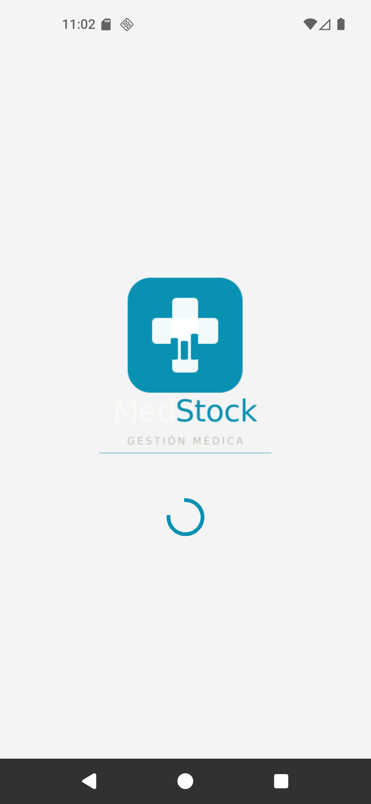
  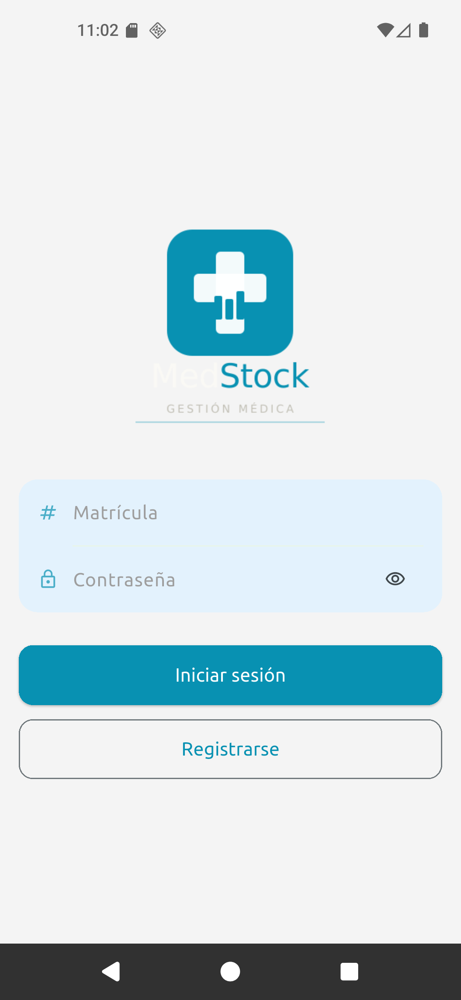
  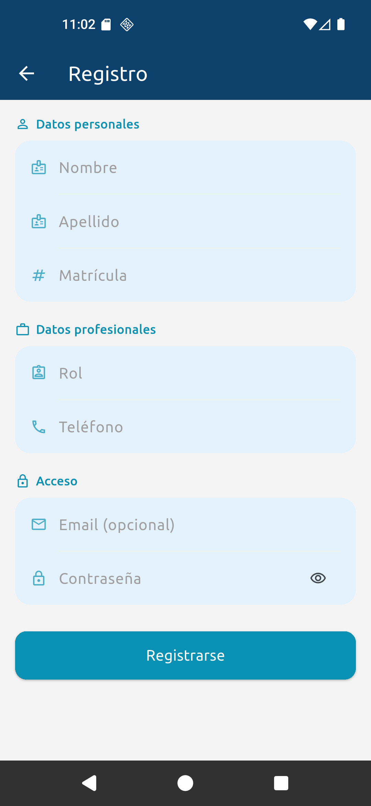
  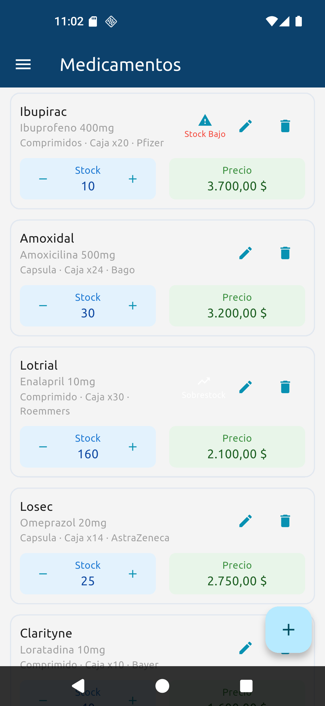
  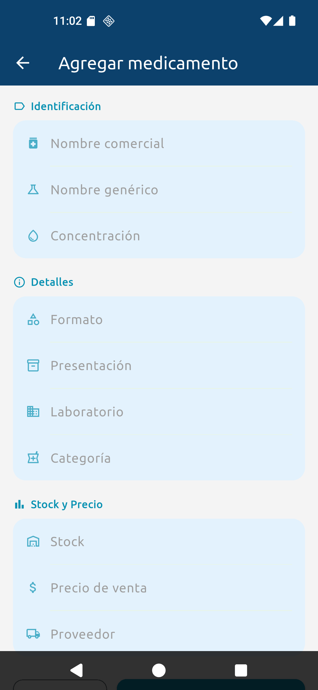
  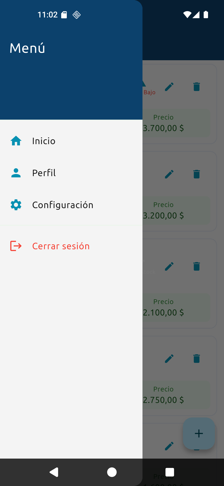
  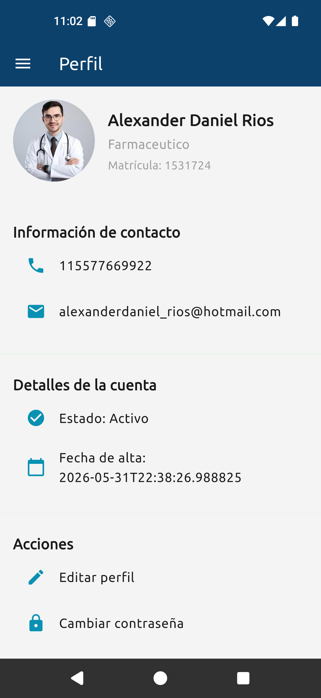
  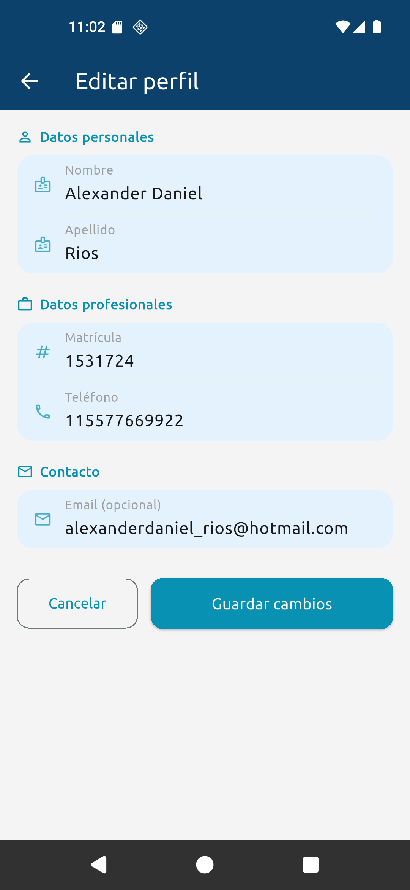
  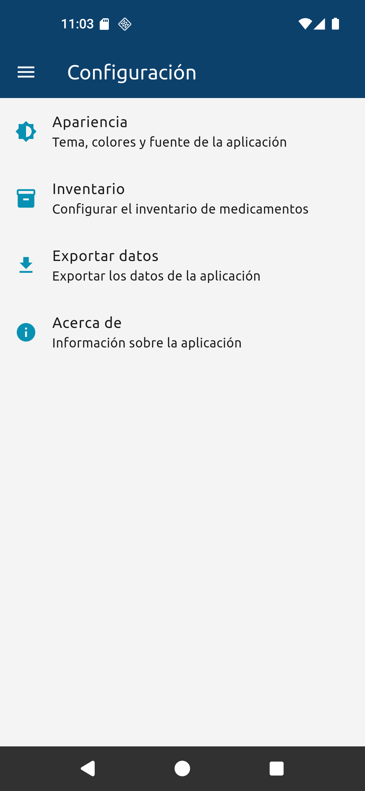
  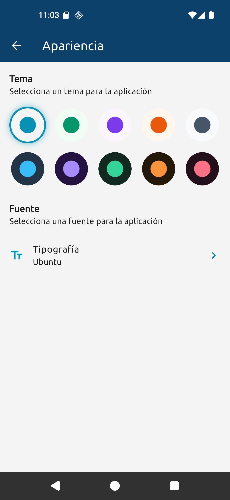
  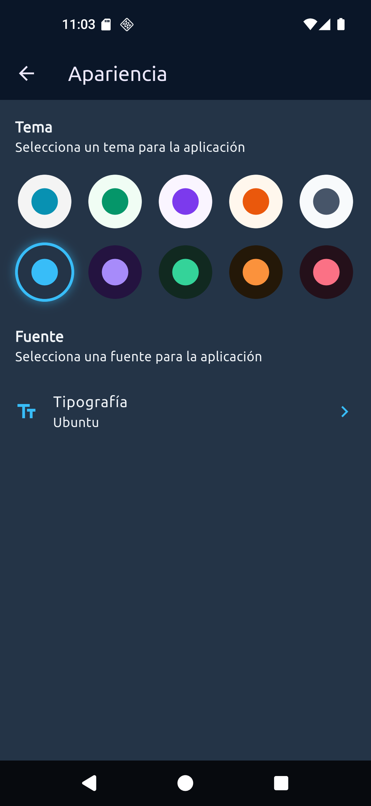
  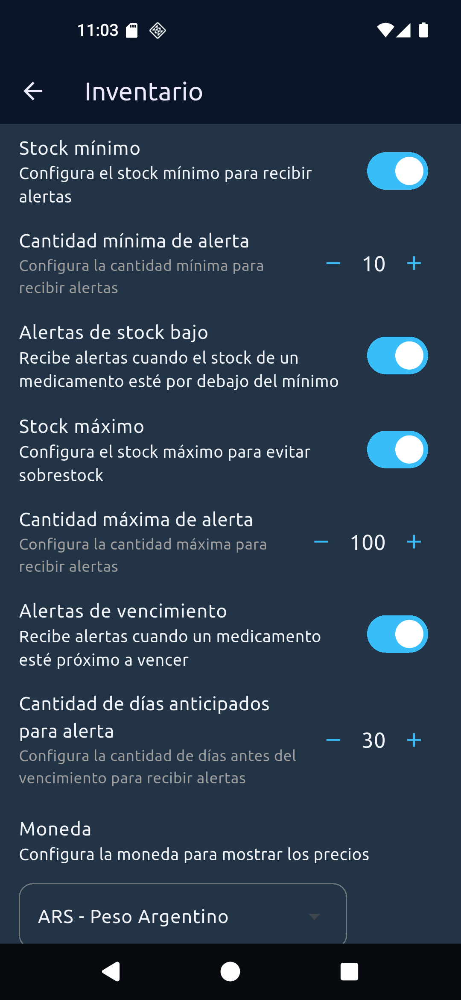
  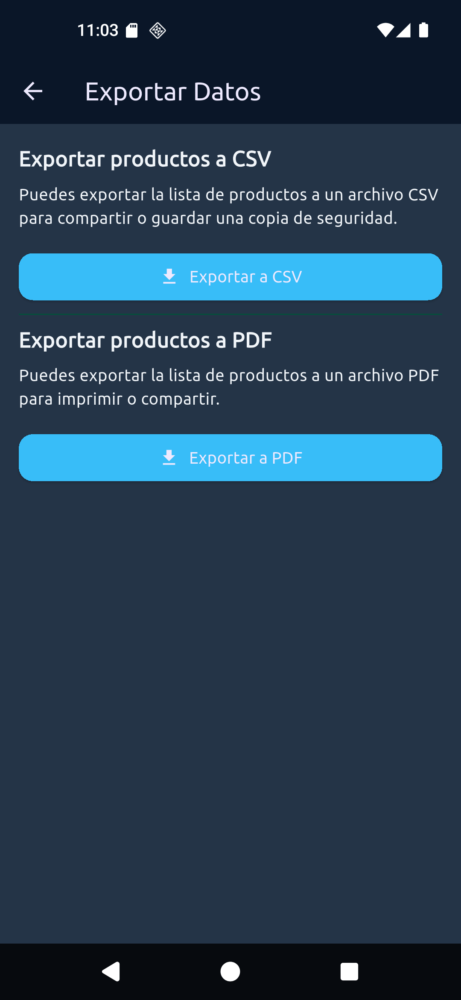
  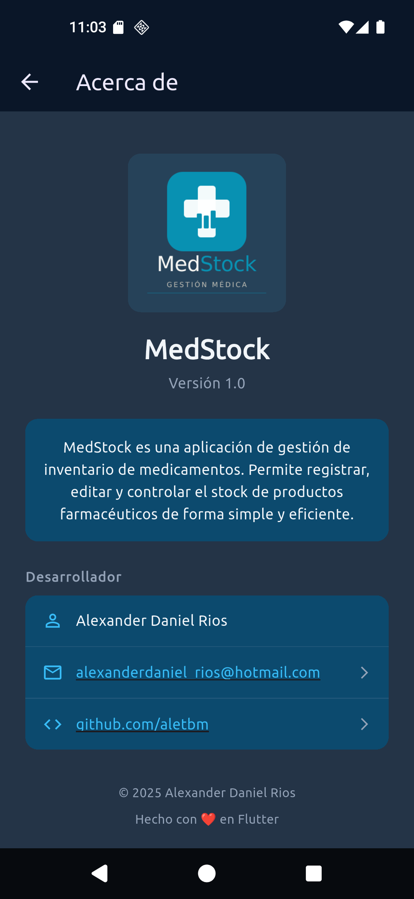
</p>

---

## 🚀 Funcionalidades

- **Autenticación** — Login y registro de usuarios con validación de matrícula
- **Gestión de productos** — Alta, baja y modificación de medicamentos
- **Control de stock** — Incremento/decremento de stock directamente desde la lista
- **Alertas de stock** — Indicadores visuales de stock bajo y sobrestock
- **Exportación** — Exportar inventario a CSV y PDF
- **Perfil de usuario** — Edición de datos personales y cambio de contraseña
- **Temas y fuentes** — Personalización visual persistente entre sesiones
- **Sesión persistente** — Login recordado con SharedPreferences

---

## 🛠️ Tecnologías

| Tecnología | Uso |
|---|---|
| [Flutter](https://flutter.dev) | Framework UI multiplataforma |
| [Riverpod](https://riverpod.dev) | Manejo de estado |
| [SQLite (sqflite)](https://pub.dev/packages/sqflite) | Base de datos local |
| [SharedPreferences](https://pub.dev/packages/shared_preferences) | Persistencia de sesión y configuración |
| [GoRouter](https://pub.dev/packages/go_router) | Navegación declarativa |
| [intl](https://pub.dev/packages/intl) | Formateo de fechas y moneda |
| [url_launcher](https://pub.dev/packages/url_launcher) | Apertura de links externos |

---

## 🏗️ Arquitectura

El proyecto sigue una arquitectura por capas inspirada en **Clean Architecture**:

```
lib/
├── config/
│   └── database/          # DBHelpers (SQLite)
├── core/
|   ├── router/            # Rutas
│   ├── services/          # Servicios (exportación, etc.)
│   └── theme/             # Colores, fuentes y temas
├── domain/
│   └── entities/          # Modelos de datos (Product, User)
└── presentations/
    ├── providers/          # Estado con Riverpod (StateNotifier)
    ├── screens/            # Pantallas organizadas por módulo
    │   ├── auth/
    │   ├── products/
    │   ├── settings/
    │   └── users/
    └── widgets/            # Widgets reutilizables
```

### Manejo de estado

Se utiliza **Riverpod** con `StateNotifier` para gestionar el estado de la aplicación. Cada entidad principal tiene su propio provider:

- `productListProvider` — Lista y operaciones CRUD de productos
- `sessionProvider` — Estado de autenticación
- `currentUserProvider` — Usuario logueado actualmente
- `themeProvider` — Tema y fuente seleccionados
- `inventoryProvider` — Configuración de inventario (moneda, stock mínimo/máximo)
- `routerProvider` — Notifier de enrutamiento
---

## ⚙️ Instalación y ejecución

### Requisitos previos

- [Flutter SDK](https://docs.flutter.dev/get-started/install) >= 3.0.0
- Android Studio o VS Code con extensión Flutter
- Dispositivo físico o emulador Android/iOS

### Pasos

```bash
# 1. Clonar el repositorio
git clone https://github.com/aletbm/medstock.git
cd medstock

# 2. Instalar dependencias
flutter pub get

# 3. Ejecutar la app
flutter run
```

---

## 📦 Dependencias principales

```yaml
dependencies:
  cupertino_icons: ^1.0.8
  go_router: ^17.2.3
  flutter_riverpod: ^3.3.1
  sqflite: ^2.4.2+1
  path: ^1.9.1
  shared_preferences: ^2.5.5
  shelf: ^1.4.2
  smooth_page_indicator: ^2.0.1
  flutter_launcher_icons: ^0.14.4
  google_fonts: ^8.1.0
  intl: ^0.20.2
  csv: ^8.0.0
  pdf: ^3.12.0
  printing: ^5.14.3
  path_provider: ^2.1.5
  share_plus: ^13.1.0
  url_launcher: ^6.3.2
```

> Verificá las versiones exactas en `pubspec.yaml`

---

## 👤 Desarrollador

**Alexander Daniel Rios**
- GitHub: [@aletbm](https://github.com/aletbm)
- Email: alexanderdaniel_rios@hotmail.com

---

## 📄 Licencia

Este proyecto es de uso personal/educativo.
